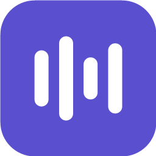
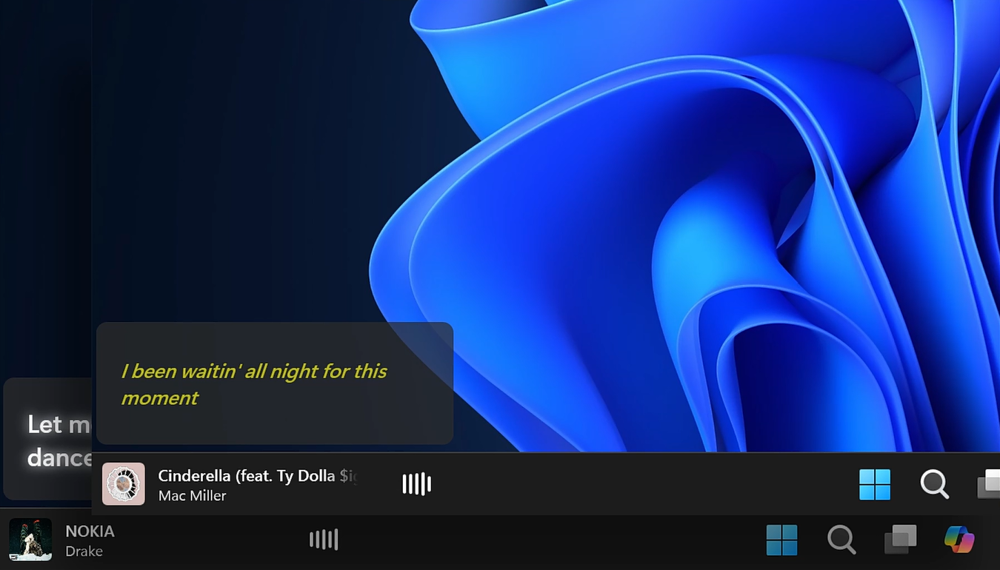
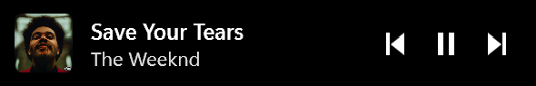
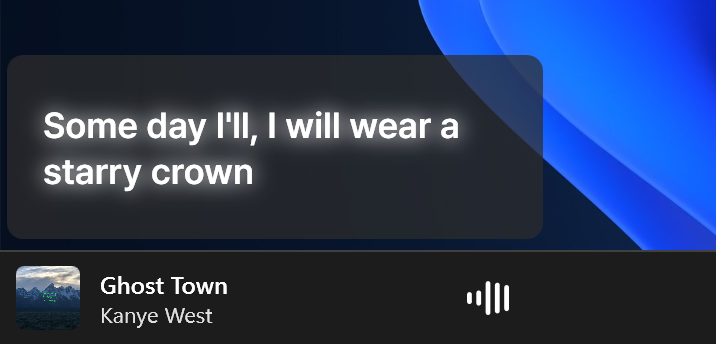
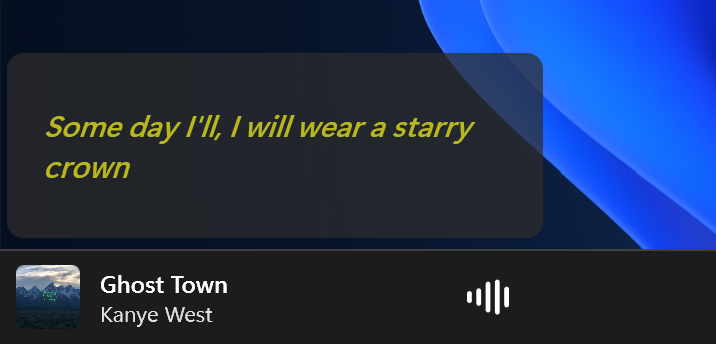
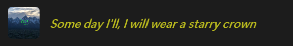
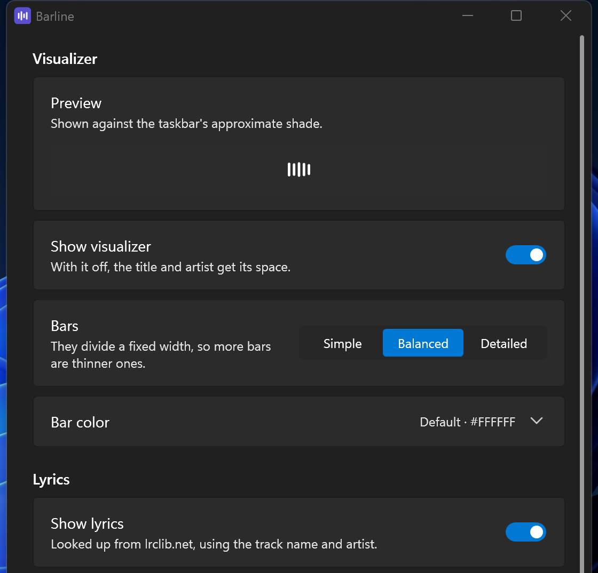

  

<h1 align="center">Barline</h1>

  <b>A now-playing widget for the Windows 11 taskbar.</b> 
  Barline displays album art, track information, a live audio visualizer, and synchronized lyrics directly on the taskbar.

  
  
  

<!--
  The cid is Microsoft's own campaign tag, and the only thing that tells the
  acquisitions report which badge someone came from. The two badges in this file
  carry different ones on purpose. Web link rather than ms-windows-store://,
  because GitHub strips schemes it does not recognize and the badge would stop
  being a link; on Windows the web link opens the Store app anyway.
-->

  

  

It is designed to integrate seamlessly into the Windows environment. It paints
no background of its own, so the taskbar's real Mica material shows through automatically. It always matches your theme, accent color, transparency, and wallpapers without imitation.

   
  Now playing
    
   
  Hover for transport controls

## Features

### Seamless taskbar widget 🎵

- Displays album art, title, and artist directly on the taskbar.
- Fixed layout that remains consistent as songs change.
- Follows taskbar position, DPI, and auto-hide behavior.

### Live audio visualizer 📊

- Driven by real WASAPI loopback audio, not a pre-rendered animation.
- Choose the number of bars.
- Bar colors can follow Windows accent, album artwork or custom colors of your choice.

### Synchronized lyrics 🎤

- Floating lyrics panel or inline display.
- Synchronized lyrics from LRCLIB.
- Word-by-word highlighting on any synced track.
- Import local `.lrc` files for any track.

### Highly customizable 🎨

- Font, size, weight, color, effects, background and corner radius, and more.
- Save and import appearance presets.
- Changes apply instantly.

### Works everywhere 🎧

Supports any player that integrates with Windows Media Controls, including:

- Spotify
- Apple Music
- Chromium-based browsers
- ...and many others

### Privacy first 🔒

- No telemetry in the app.
- No accounts.
- No network access unless lyrics are enabled.

The Store build is distributed by Microsoft, which reports aggregate install and crash
counts to the developer. Barline neither performs nor controls that; see
[PRIVACY.md](PRIVACY.md).

## Install

Requires **Windows 11**.

**Microsoft Store** is the recommended way to install Barline. It installs in one
click, updates itself, and removes cleanly. The app is free, and a single optional
purchase unlocks some extra customization.

  

Developers, contributors, and anyone who would rather compile it can **build it
yourself** from the source. It gives you the same application with every feature
enabled. It needs the .NET SDK installed; read [CONTRIBUTING.md](CONTRIBUTING.md) for
the steps.

See [Keeping Barline Going](#keeping-barline-going) for more information.

The first launch explains the rest, including this, which only matters if Windows is
still showing its own button in the same corner:

> **Settings → Personalization → Taskbar → Taskbar items → Widgets: Off**

Note that the widget hides itself while nothing is playing, so a quiet machine looks
exactly as it did before. Start a track and it appears.

Right-click the widget for **Settings**, **Show visualizer**, **Restart visualizer**
and **Exit**. The same menu is on the notification-area icon, which is where to reach
it while the widget is hidden.

## Lyrics

Lyrics are disabled by default because looking up a track sends its title and artist to [LRCLIB](https://lrclib.net). Turn it on under **Lyrics → Show lyrics**.

They go either in a **floating panel** above the taskbar, which you can move, resize
and give a look of your own:

<table>
<tr>
<td width="50%" align="center"></td>
<td width="50%" align="center"></td>
</tr>
</table>

Or **inside the widget**, replacing the title until you hover it:

  

The panel passes clicks straight through, hides for fullscreen apps, and slides away
with auto-hide.

Word-level timing is estimated from syllable count, including for Hangul, kana and CJK,
which are counted per character rather than by vowel groups.

Got better timings? Use **Import for this track…** in settings, or drop an `.lrc` file
into the lyrics folder yourself. **Open folder** beside the button gets you there. A
file always takes priority over the network, and clearing the cache never touches it.

## Settings

  

Everything applies immediately. There is no OK button, and the widget is on screen the
whole time, so every change is previewed where it counts.

Bar color follows your **accent**, the **album art** (crossfading as tracks change),
or a color you choose. Bar colors automatically adjust to maintain a minimum 3:1 contrast ratio against the taskbar, ensuring the visualizer remains visible regardless of album artwork. The settings window shows the color that will actually be drawn.

Lyric styles are saved as **preset files**. Seven built-in presets ship with the app,
four of which need Barline Plus because they glow; the other three are always there.
Drop one someone sends you into the presets folder and it appears in the list. Use
**Open folder** next to the preset picker to get there, since the location differs
between the portable and Microsoft Store builds.

**About** at the bottom of the page shows the version and which build it is, and opens
the license, the third-party notices and the data folder. That is the only route to any
of them in the Store build, whose install folder Windows will not let you browse.

## Keeping Barline Going

Barline is free and open source. The Microsoft Store is the easiest way to install it
and keep it updated automatically. A one-time Barline Plus purchase unlocks additional
customization and helps fund continued development.

The complete source code is on GitHub for anyone who wants to build, modify, study, or
contribute to Barline.

Buying it is never required, but it is a great support for the development of the
project. Thank you for your support!

## Known limitations

- **Primary monitor only.** Secondary-monitor taskbars are not tracked yet.
- **The visualizer hears everything**, not just the media session on display, so other
  system audio moves the bars.
- **Click-to-focus is best-effort.** Windows identifies media sessions in a way that
  does not always map back to a window it will agree to activate.
- **A build of your own is unsigned**, so SmartScreen will warn the first time you run
  it. The Store build is signed by Microsoft and does not.

## Documentation

- **[📖 Design notes](docs/design.md)**
- **[🤝 Contributing](CONTRIBUTING.md)**
- **[🔒 Privacy](PRIVACY.md)**

## License

Licensed under [GPL-3.0-or-later](LICENSE).

Third-party component licenses are available in
[THIRD-PARTY-NOTICES.md](THIRD-PARTY-NOTICES.md).

Both files ship beside the executable in every build, and **Settings → About** opens
them without leaving the app.
